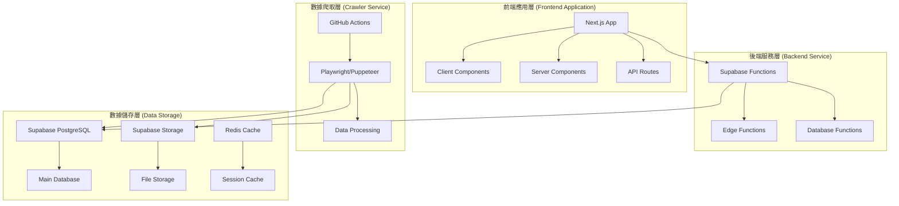

# 全球軟體資訊平台專案規格書 (PRD)

**版本：** 1.0  
**日期：** 2025-01-16  
**專案代號：** SoftHub  
**專案狀態：** 規劃階段

## 專案概述

### 專案目標

建立一個多語言、使用者友善的全球軟硬體互動資訊與學習平台。此平台旨在讓普通用戶、技術愛好者及專業開發者能夠輕鬆地發現、評價、比較及交流各種軟硬體產品的使用心得與學習經驗。

### 核心定位

- **內容聚合與發現**：專注於聚合來自全球頂尖來源的軟硬體資訊、開源專案（Repo）及 IT 新聞
- **社群互動與評價**：提供一個中立的平台，讓用戶可以發表評論、評分，並圍繞特定產品或技術進行討論
- **輕量化託管**：初期僅託管文字、圖片及外部影片連結，不託管原始程式碼或影片檔案，以降低複雜度和維護成本
- **全球化與親民化**：支援多語言（優先支援中文、英文、日文），並採用直觀、簡潔的 UI/UX 設計，降低使用門檻

## 技術架構選型

### 爬蟲技術選型

- **爬蟲定時任務與自動化測試框架**：Playwright, Puppeteer, Selenium, GitHub Actions
- **爬蟲資料庫寄存**：
  1. **原始資料寄存**：Supabase Storage
     - 優點：與主資料庫 Supabase (PostgreSQL) 無縫整合，可透過 Supabase 的 API 和權限管理（RLS）進行存取
     - 流程：爬蟲任務抓取原始資料（HTML, JSON），直接上傳至 Supabase Storage 的特定 Bucket（例如 raw-data），並以 `來源/日期/uuid.html` 的形式命名
  2. **清洗後資料寄存**：Supabase (PostgreSQL)
     - MDX 檔案可以視為結構化資料的一部分，儲存在 text 類型的欄位中

### 網頁技術選型

- **全端框架**：[Next.js](https://nextjs.org/)，使用 App Router，國際化庫：React-i18next
- **CSS+UI庫**：Tailwind CSS, Ant Design, Radix UI + 自定義
- **前端認證**：Supabase Auth
- **後端網頁寄存**：Supabase
- **其他技術選型**：
  - 語法檢查：ESLint + Prettier
  - 性能測試框架：Lighthouse CI
  - 分割工具：Next.js 內建代碼分割 + @loadable/component
  - 預加載庫：quicklink（Google 出品）
  - 分析工具：Lighthouse CI + Treo（可視化監控）

## 系統架構

本專案採用基於 Next.js 和 Supabase 的現代化 Serverless 架構，以實現高效能、高擴展性與低維護成本。

### 架構層次

## 各層執行細節與步驟

### 數據爬取層 (Crawler Service)

#### 觸發器與執行環境
- **觸發器**：使用 GitHub Actions 作為排程器 (Scheduler)，每日定時觸發爬蟲任務
- **執行環境**：爬蟲腳本打包成 Docker 容器，在 GitHub Actions 的虛擬環境中執行，確保執行環境的一致性

#### 錯誤處理與日誌
- **錯誤處理機制**：爬蟲任務必須包含完整的錯誤處理機制
- **日誌記錄**：每次執行都應產生詳細日誌（成功爬取數量、失敗項目、失敗原因），並將日誌上傳至 Supabase Storage 或專門的日誌服務（如 Logtail）

#### 數據校驗
- **數據驗證**：在存入 PostgreSQL 之前，使用 Zod 或類似的校驗庫對清洗後的 JSON 數據進行嚴格的結構與類型校驗，確保數據庫的完整性

### 後端服務層 (Backend Service)

#### 架構組成
- **Server Components**：由 Next.js 的 Server Components 構成，負責在伺服器端直接讀取 Supabase 資料庫，進行伺服器端渲染 (SSR) 或靜態網站生成 (SSG)
- **API Routes**：負責處理前端的動態請求、使用者認證、資料庫寫入操作（如發表評論）
- **Server Actions**：Next.js 13+ 的 Server Actions 處理表單提交和數據變更，簡化客戶端與伺服器之間的代碼

#### 性能優化
- **數據快取**：對於不常變動但請求頻繁的數據（如 CPU/GPU 天梯圖、熱門 Repo 榜），在後端進行積極的快取策略
- **ISR 機制**：利用 Next.js 的 fetch 快取或 ISR (Incremental Static Regeneration) 機制，設定合理的過期時間（例如每小時或每半天重新生成一次）

### 前端應用層 (Frontend Application)

#### 組件架構
- **Client Components**：由 Next.js 的 Client Components 構成，使用 React 進行開發，負責處理使用者互動、動態 UI 更新和客戶端數據請求
- **狀態管理**：
  - **伺服器狀態**：使用 React Query (TanStack Query) 或 SWR 管理來自 API 的數據
  - **全域客戶端狀態**：使用 Zustand 或 Jotai 管理用戶認證狀態、主題等全域狀態

#### 認證與國際化
- **使用者認證**：透過 Supabase Auth 處理使用者登入、註冊和會話管理
- **多語言支援**：使用 React-i18next 實現多語言切換

### 數據儲存層 (Data Storage)

#### 主要數據庫
- **Supabase (PostgreSQL)**：作為主資料庫，儲存所有爬取的資訊、使用者資料、評論等
- **Supabase Storage**：用於儲存使用者上傳的頭像或評論中的圖片
- **Redis Cache**：用於會話管理和熱門數據的快取

## 網站各頁面配置與說明

### 登入頁 (Login Page)

#### 佈局設計
- **左右分欄佈局**：
  - 左側：品牌 Logo、Slogan、動態輪播展示平台核心價值
  - 右側：登入/註冊表單，包含使用者帳號、密碼、忘記密碼功能
- **導航設計**：頁面頂部保留極簡的 Navbar，僅包含 Logo 和語言切換選項

#### 功能特性
- **多種登入方式**：支援 OAuth 登入（Email, Google, GitHub）
- **安全性**：所有密碼傳輸使用 HTTPS，後端進行安全的雜湊儲存 (hashing)

### 首頁 (Home Page)

#### 頂部導航欄 (Navbar)
- **Logo**：鏈回首頁
- **學習進度**：用戶專屬學習追蹤
- **認證狀態**：顯示用戶認證等級
- **語言切換**：多語言支援下拉菜單
- **用戶頭像/登入按鈕**：用戶狀態顯示

#### 頂部搜索欄
- **智能搜索建議**：基於用戶歷史和熱門內容
- **過濾選項**：內容類型、時間範圍篩選
- **高級搜索**：鏈接到詳細搜索頁面

#### 左側邊欄 (Sidebar)
- **分類導航**：各類工程師專業分類
- **快速篩選**：常用標籤和分類

#### 右側邊欄 (Sidebar)
- **動態細項篩選**：根據左側選擇的大分類，動態顯示相關的細項標籤 (Tags)
- **個性化推薦**：基於用戶興趣的內容推薦

#### 中間主內容區 (Layout)
- **今日頭條**：輪播展示重要科技新聞
- **排行榜模塊**（帶時間篩選）：
  - 硬體：CPU 天梯圖、GPU 天梯圖
  - 軟體/Repo：本週、本月熱門 Repo 榜（基於 Star 增長量）
  - 熱門開源項目（按 star 數、貢獻者數）
  - 學習資源熱度榜
- **個性化推薦**：基於用戶興趣的內容推薦

#### 底部 Footer
- **網站導航**：主要頁面連結
- **關於我們**：平台介紹
- **隱私政策**：用戶隱私保護
- **服務條款**：使用條款
- **社交媒體鏈接**：官方社群媒體
- **版權信息**：版權聲明

### 詳情頁面

#### Repo 詳情頁
- **基本資訊**：Logo、描述、Readme.md 內容
- **統計數據**：License, Stars, Forks, Contributors
- **技術標籤**：主要使用的程式語言、框架
- **社群互動**：相關評論和討論

#### 硬體詳情頁
- **規格資訊**：詳細的硬體規格參數
- **評測連結**：相關評測文章連結
- **新聞動態**：相關硬體新聞
- **用戶評價**：使用者使用心得和評分

#### 使用者個人頁
- **基本資料**：用戶個人資訊
- **內容管理**：發表的評論、收藏的項目
- **學習進度**：各科學習進度追蹤
- **認證系統**：已獲得的個人分數與認證

## 組件架構說明

### Server Components vs Client Components 分配原則

#### Server Components
**主要職責**：數據讀取與展示
- **適用場景**：
  - 首頁的排行榜
  - Repo 詳情頁的 Readme 內容
  - 文章列表
  - 靜態內容展示
- **優勢**：
  - 在伺服器端直接存取 Supabase
  - 將渲染好的靜態 HTML 發送給客戶端
  - 實現極速載入和優異的 SEO

#### Client Components
**主要職責**：互動性強的 UI 元素
- **適用場景**：
  - 需要使用 useState, useEffect 的組件
  - 互動式表單
  - 語言切換下拉菜單
  - 響應點擊事件的按鈕
  - 動態內容更新

#### API Routes / Server Actions
**主要職責**：數據寫入與用戶操作
- **適用場景**：
  - 用戶登入/註冊
  - 發表評論
  - 收藏項目
  - 更新個人資料
- **技術選擇**：Next.js 13+ 的 Server Actions 是處理表單提交和數據變更的更現代化選擇

### 狀態管理策略

#### 伺服器狀態
- **推薦工具**：React Query (TanStack Query) 或 SWR
- **功能特性**：自動處理快取、重新驗證和樂觀更新
- **整合方式**：與 Server Actions/API Routes 完美配合

#### 全域客戶端狀態
- **推薦工具**：Zustand 或 Jotai
- **適用場景**：用戶認證狀態、主題（深/淺色模式）等
- **優勢**：比 Redux 更輕量、更易用

### UI/UX 優化策略

#### 組件庫選擇
- **Radix UI**：作為無頭 (Headless) UI 元件庫，確保可訪問性 (Accessibility) 並提供最大的自定義彈性
- **Tailwind CSS**：進行樣式設計，提供快速開發和一致的設計系統
- **Ant Design**：用於後台管理頁面，快速搭建功能複雜的介面

## 網站內容來源

### Repo 來源
- **GitHub API**：官方 REST/GraphQL API
- **Hugging Face API**：AI 模型和工具
- **GitLab API**：開源專案託管
- **SourceForge API**：開源軟體平台
- **YouTube API**：技術教學影片

### IT 新聞來源
- **國際媒體**：
  - [掘金](https://juejin.cn/)
  - [Tom's Hardware](https://www.tomshardware.com/)
  - [Wired](https://www.wired.com/)
  - [CNET](https://www.cnet.com/)
- **台灣媒體**：
  - [TechOrange 科技報橘](https://techorange.com/)
  - [INSIDE 硬塞的網路趨勢觀察](https://www.inside.com.tw/)
  - [電腦王阿達的3C胡言亂語](https://www.kocpc.com.tw/)
  - [T客邦](https://www.techbang.com/)
- **中國媒體**：
  - [36氪](https://36kr.com/)

### 學習資源來源
- **線上課程平台**：Udemy API、Coursera API
- **技術文檔**：各開源專案官方文檔

### 排名數據來源
- **硬體排名**：[PassMark](https://www.passmark.com/) - CPU/GPU 性能排行
- **資料庫排名**：[DB-Engines](https://db-engines.com/en/ranking) - 資料庫流行度排行
- **LLMs 排名**：[Hugging Face Open LLM Leaderboard](https://huggingface.co/spaces/open-llm-leaderboard/open_llm_leaderboard)

## 商業模式

### 初期階段 (上線後 0-6 個月)

#### 廣告收入
1. **原生廣告**：將廣告設計得與普通內容卡片樣式一致，僅在角落標註「廣告」或「贊助」
2. **Google AdSense**：在頁面的非核心位置（如右側邊欄、文章底部）放置內容相關廣告

#### 聯盟行銷 (Affiliate Marketing)
1. **透明化策略**：在頁面底部或相關連結旁明確告知用戶「本頁面包含聯盟連結，您的購買將支持本站運營」
2. **硬體比價**：在硬體詳情頁提供來自多個電商（Amazon, Newegg 等）的帶有聯盟 ID 的連結

### 中期階段 (上線後 6-18 個月)

#### 會員訂閱模式
1. **登入訂閱者（免費）**：
   - 每日免費觀看 3 篇付費文章
   - 第四篇開始只能看到一部分內容
2. **進階付費使用者**：
   - 免費觀看所有付費文章
   - 無廣告體驗
3. **白金付費使用者**：
   - 進階篩選功能（按公司、貢獻者地理位置篩選 Repo）
   - 搶先體驗新功能
   - 數據導出功能（CSV/JSON）

### 長期階段 (上線後 18+ 個月)

#### 企業服務 (B2B)
1. **贊助內容**：允許軟硬體廠商付費發布「精選文章」或在排行榜中獲得「贊助商」標示
2. **人才招聘**：開設招聘板塊，企業可付費發布與平台技術標籤相關的職位
3. **數據 API 服務**：將脫敏、聚合後的趨勢數據以 API 形式提供給市場分析機構或企業

#### 其他現金流來源
1. **技術認證體系**：
   - 基礎認證（免費）
   - 專業認證（$49/次）
   - 企業認證（$299/帳號）
2. **企業市場趨勢報告**：技術棧分析、薪資水平數據
3. **招聘解決方案**：智能人崗匹配、技術能力評估、招聘流程管理

## 競品分析

### 主要競品
- [Product Hunt](https://www.producthunt.com/)：新產品發現平台
- [SourceForge](https://sourceforge.net/)：開源軟體託管平台
- [W3Schools](https://www.w3schools.com/)：技術學習平台
- [OpenRouter App Store](https://openrouter.co/appstore)：AI 應用商店

### 競品優缺點分析
- **Product Hunt**：優點是社群活躍度高，缺點是內容深度不足
- **SourceForge**：優點是開源專案豐富，缺點是介面老舊
- **W3Schools**：優點是學習資源完整，缺點是缺乏社群互動
- **OpenRouter**：優點是 AI 應用集中，缺點是技術範圍有限

## 專案時程規劃

### 第一階段 (1-3 個月)
- 基礎架構搭建
- 核心爬蟲系統開發
- 基本 UI 框架建立

### 第二階段 (4-6 個月)
- 完整功能開發
- 測試與優化
- 內部測試版上線

### 第三階段 (7-9 個月)
- 公開測試版
- 用戶反饋收集
- 功能迭代優化

### 第四階段 (10-12 個月)
- 正式版上線
- 市場推廣
- 商業模式驗證

## 風險評估與應對策略

### 技術風險
- **爬蟲穩定性**：建立多套備用爬蟲策略
- **數據品質**：實施多層數據驗證機制
- **系統擴展性**：採用微服務架構，確保水平擴展能力

### 商業風險
- **用戶增長**：建立完善的用戶獲取策略
- **收入模式**：多元化收入來源，降低單一收入依賴
- **競爭壓力**：持續創新，建立技術壁壘

### 法律風險
- **版權問題**：嚴格遵守各平台使用條款
- **數據隱私**：符合 GDPR、CCPA 等國際隱私法規
- **內容合規**：建立內容審核機制

## 總結

本專案旨在建立一個全球化的軟硬體資訊平台，通過技術創新和用戶體驗優化，為全球用戶提供高品質的技術資訊服務。通過分階段實施和持續迭代，我們有信心將 SoftHub 打造成為業界領先的技術資訊平台。
