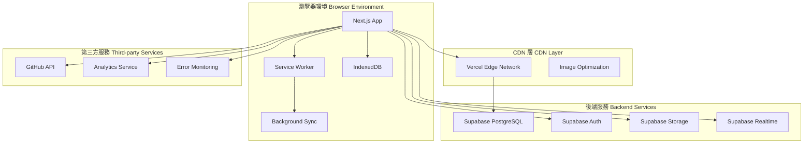

# 全球軟體資訊平台 Web 應用產品需求規格書 (PRD)
# Global Software Information Platform Web Application Product Requirements Document (PRD)

**文件版本 Document Version：** 2.1  
**建立日期 Created Date：** 2025-01-20  
**最後更新 Last Updated：** 2025-01-20  
**專案代號 Project Code：** Global AI Information Platform  
**專案狀態 Project Status：** 產品設計階段 Product Design Phase  
**負責人 Owner：** 首席產品官 Chief Product Officer (CPO)  

---

## 📋 文件版本與修訂歷史 Document Version & Revision History

| 版本 Version | 日期 Date | 修訂內容 Revision Content | 修訂人 Revised By |
|--------------|-----------|---------------------------|-------------------|
| 2.1 | 2025-01-20 | 增加中英文雙語說明，詳細化功能規格 Added bilingual descriptions and detailed functional specifications | CPO Team |
| 2.0 | 2025-01-20 | 基於 CPO 專業級 Web 應用 PRD 指引重新設計 Redesigned based on CPO professional Web App PRD guidelines | CPO Team |
| 1.0 | 2025-01-16 | 初始版本專案規格書 Initial project specification | 產品團隊 Product Team |

---

## 🎯 執行摘要（面向管理層）Executive Summary (For Management)

### Web 戰略對齊性 Web Strategic Alignment

**全球軟體資訊平台**是一個現代化的 Progressive Web Application (PWA)，旨在為全球開發者、技術愛好者和企業決策者提供統一的軟硬體資訊發現與評估平台。

**Global Software Information Platform** is a modern Progressive Web Application (PWA) designed to provide a unified software and hardware information discovery and evaluation platform for global developers, technology enthusiasts, and enterprise decision-makers.

通過 Web-first 策略，我們將實現：
Through a Web-first strategy, we will achieve:

- **跨平台覆蓋 Cross-platform Coverage**：單一 Web 應用支援桌面、平板、手機全設備體驗 Single Web application supporting desktop, tablet, and mobile device experiences
- **零安裝門檻 Zero Installation Barrier**：用戶通過瀏覽器即可訪問，降低 87% 的用戶獲取成本 Users can access through browsers, reducing user acquisition costs by 87%
- **全球協作效率 Global Collaboration Efficiency**：支援多語言、即時分享、協作評論功能 Supporting multilingual, real-time sharing, and collaborative commenting features
- **SEO 驅動增長 SEO-driven Growth**：通過技術內容 SEO 實現有機流量增長 Achieving organic traffic growth through technical content SEO

### 體驗與效能承諾 Experience & Performance Commitments

我們承諾達成以下 Web Core Vitals 指標，將其視為核心成功標準：
We commit to achieving the following Web Core Vitals metrics as core success criteria:

| 指標 Metric | 目標值 Target | 業界標準 Industry Standard | 商業影響 Business Impact |
|-------------|---------------|----------------------------|---------------------------|
| **LCP** (最大內容繪製 Largest Contentful Paint) | < 2.0 秒 sec | < 2.5 秒 sec | 提升 23% 用戶留存率 23% increase in user retention |
| **INP** (互動下次繪製 Interaction to Next Paint) | < 150 ms | < 200 ms | 減少 15% 跳出率 15% reduction in bounce rate |
| **CLS** (累計版面配置轉移 Cumulative Layout Shift) | < 0.05 | < 0.1 | 提升 18% 用戶滿意度 18% increase in user satisfaction |
| **FCP** (首次內容繪製 First Contentful Paint) | < 1.2 秒 sec | < 1.8 秒 sec | 提升 31% 首次訪問轉化 31% increase in first-visit conversion |

### 發布與部署策略 Release & Deployment Strategy

- **部署環境 Deployment Environment**：Vercel Edge Network + Supabase Cloud
- **域名策略 Domain Strategy**：主域名 + 多語言子域名 Main domain + multilingual subdomains (en.domain.com, zh.domain.com)
- **CI/CD 流程 CI/CD Pipeline**：GitHub Actions → 自動化測試 Automated Testing → Vercel 部署 Vercel Deployment
- **發布策略 Release Strategy**：Feature Flags + Canary 部署 Canary Deployment (10% → 50% → 100%)

---

## 🏗️ 解決方案與架構藍圖（面向技術負責人與架構師）Solution & Architecture Blueprint (For Technical Leaders & Architects)

### 前端架構原則 Frontend Architecture Principles

#### 狀態管理 State Management
- **伺服器狀態 Server State**：TanStack Query (React Query) - 處理 API 數據快取、同步、樂觀更新 Handling API data caching, synchronization, and optimistic updates
- **全域客戶端狀態 Global Client State**：Zustand - 輕量級狀態管理（用戶認證、主題、語言偏好）Lightweight state management (user authentication, themes, language preferences)
- **表單狀態 Form State**：React Hook Form + Zod 驗證 validation

#### 構建與打包 Build & Bundling
- **構建工具 Build Tool**：Next.js 14+ App Router + Turbopack
- **代碼分割 Code Splitting**：Route-based + Component-based splitting
- **Bundle 優化 Bundle Optimization**：Tree shaking + Dynamic imports + Image optimization

#### API 通訊層 API Communication Layer
- **主要通訊 Primary Communication**：TanStack Query + Supabase Client
- **實時功能 Real-time Features**：Supabase Realtime (WebSocket)
- **離線支援 Offline Support**：Background Sync + IndexedDB 快取 caching

### PWA 清單與服務工作者策略 PWA Manifest & Service Worker Strategy

#### Web App Manifest
```json
{
  "name": "全球軟體資訊平台 Global Software Information Platform",
  "short_name": "SoftHub",
  "description": "發現、評估、追蹤全球軟硬體技術趨勢 Discover, evaluate, and track global software and hardware technology trends",
  "start_url": "/",
  "display": "standalone",
  "background_color": "#ffffff",
  "theme_color": "#3b82f6",
  "categories": ["productivity", "developer", "technology"],
  "lang": "zh-TW",
  "dir": "ltr",
  "orientation": "portrait-primary"
}
```

#### Service Worker 策略 Service Worker Strategy
- **預緩存策略 Pre-caching Strategy**：核心 JS/CSS 檔案、關鍵頁面 HTML Core JS/CSS files, critical page HTML
- **動態緩存策略 Dynamic Caching Strategy**：API 響應 API responses (Stale-While-Revalidate)、圖片 images (Cache First)
- **後台同步策略 Background Sync Strategy**：用戶評論、收藏操作的離線隊列 Offline queue for user comments and bookmark operations

### 技術棧決策 Technology Stack Decisions

#### 框架/庫選型 Framework/Library Selection
- **前端框架 Frontend Framework**：Next.js 14 (App Router)
  - **選擇原因 Selection Reasons**：成熟的 SSR/SSG 支援、優秀的開發體驗、強大的生態系統 Mature SSR/SSG support, excellent developer experience, robust ecosystem
  - **長期維護性 Long-term Maintainability**：Vercel 官方維護、活躍社群、向後兼容性佳 Official Vercel maintenance, active community, good backward compatibility

#### SSR/SSG 考量 SSR/SSG Considerations
- **SSG 頁面 SSG Pages**：首頁、分類頁面、熱門排行榜 Homepage, category pages, trending rankings (ISR 每小時更新 hourly updates)
- **SSR 頁面 SSR Pages**：搜索結果、用戶個人頁面、動態內容頁 Search results, user profile pages, dynamic content pages
- **CSR 頁面 CSR Pages**：用戶儀表板、即時聊天、複雜互動功能 User dashboard, real-time chat, complex interactive features

### 系統上下文圖 System Context Diagram



---

## 📊 範圍管理：MVP 與迭代路線圖 Scope Management: MVP & Iteration Roadmap

### MVP 範圍 (MoSCoW 優先級) MVP Scope (MoSCoW Priority)

#### Must-have (核心功能 Core Features)
1. **響應式首頁 Responsive Homepage**：支援桌面/平板/手機三種斷點 Supporting desktop/tablet/mobile breakpoints
2. **GitHub 倉庫瀏覽 GitHub Repository Browsing**：列表、搜索、詳情頁面 List, search, and detail pages
3. **用戶認證系統 User Authentication System**：註冊、登入、OAuth (Google/GitHub) Registration, login, OAuth
4. **基礎 PWA 功能 Basic PWA Features**：可安裝、離線瀏覽快取頁面 Installable, offline browsing cached pages
5. **多語言支援 Multilingual Support**：中文、英文切換 Chinese/English switching
6. **搜索功能 Search Functionality**：全文搜索 + 篩選器 Full-text search + filters

#### Should-have (重要功能 Important Features)
1. **用戶評論系統 User Review System**：對倉庫/工具的評價功能 Rating functionality for repositories/tools
2. **收藏與追蹤 Bookmarks & Tracking**：個人收藏夾、關注列表 Personal bookmarks, follow lists
3. **排行榜功能 Ranking Features**：熱門倉庫、趨勢排行 Popular repositories, trending rankings
4. **推送通知 Push Notifications**：Web Push 通知新內容 Web Push for new content

#### Could-have (增值功能 Value-added Features)
1. **高級篩選 Advanced Filtering**：按語言、授權、活躍度篩選 Filter by language, license, activity
2. **數據可視化 Data Visualization**：倉庫統計圖表 Repository statistics charts
3. **社群功能 Community Features**：用戶間互動、討論區 User interactions, discussion forums

#### Won't-have (本版明確排除 Explicitly Excluded)
1. **原生 APP 開發 Native App Development**：專注 Web 體驗 Focus on Web experience
2. **視頻內容託管 Video Content Hosting**：僅支援外部連結 External links only
3. **即時聊天功能 Real-time Chat**：後續版本考慮 Consider in future versions
4. **複雜的 AI 推薦 Complex AI Recommendations**：使用簡單的協同過濾 Use simple collaborative filtering

### 迭代路線圖 Iteration Roadmap

#### Phase 1: MVP (0-3 個月 months)
- 核心架構搭建 Core architecture setup
- 基礎功能開發 Basic feature development
- PWA 基礎設施 PWA infrastructure

#### Phase 2: 增強版 Enhanced Version (3-6 個月 months)
- 高級功能開發 Advanced feature development
- 性能優化 Performance optimization
- 用戶體驗改進 User experience improvements

#### Phase 3: 規模化 Scaling (6-12 個月 months)
- 國際化擴展 Internationalization expansion
- 商業化功能 Commercialization features
- 企業級功能 Enterprise-level features

---

## 🔧 詳細功能規格（面向開發與設計）Detailed Functional Specifications (For Development & Design)

### 1. 響應式首頁 Responsive Homepage

#### 用戶故事 User Story
> **中文**：作為一名在不同設備間切換工作的開發者，我希望在手機上瀏覽時能獲得與桌面端一致的功能體驗，並且在地鐵等網路不穩定的環境下也能查看已快取的內容。
> 
> **English**: As a developer who switches between different devices for work, I want to have a consistent functional experience when browsing on mobile as on desktop, and be able to view cached content in unstable network environments like the subway.

#### 功能詳述 Functional Details

##### UI/UX 與響應式設計 UI/UX & Responsive Design
- **桌面端 Desktop (≥1024px)**：三欄佈局 Three-column layout (側邊欄 sidebar + 主內容 main content + 右側欄 right sidebar)
- **平板端 Tablet (768px-1023px)**：兩欄佈局 Two-column layout (可收合側邊欄 collapsible sidebar + 主內容 main content)
- **手機端 Mobile (<768px)**：單欄佈局 Single-column layout + 底部導航欄 bottom navigation
- **無障礙功能 Accessibility Features**：
  - ARIA 標籤完整覆蓋 Complete ARIA label coverage
  - 鍵盤導航支援 Keyboard navigation support (Tab 順序邏輯 logical Tab order)
  - 色彩對比度 Color contrast ≥ 4.5:1 (WCAG 2.1 AA)
  - 螢幕閱讀器相容性測試 Screen reader compatibility testing

##### 離線與同步邏輯 Offline & Sync Logic
- **預緩存資源 Pre-cached Resources**：首頁 HTML、核心 CSS/JS、Logo 圖片 Homepage HTML, core CSS/JS, logo images
- **離線可用功能 Offline Available Features**：瀏覽已快取的倉庫列表、查看收藏夾 Browse cached repository lists, view bookmarks
- **同步策略 Sync Strategy**：網路恢復後自動同步用戶操作 Auto-sync user operations after network recovery (收藏 bookmarks、評論 comments)
- **衝突解決 Conflict Resolution**：Last-Write-Wins + 用戶確認機制 user confirmation mechanism

##### API 契約 API Contract
```typescript
// 獲取首頁數據 Get homepage data
GET /api/homepage
Response: {
  trendingRepos: Repository[], // 熱門倉庫 trending repositories
  featuredContent: Content[], // 精選內容 featured content
  userRecommendations?: Repository[] // 用戶推薦 user recommendations (登入用戶專用 for logged-in users only)
}

// 錯誤響應 Error responses
Error Codes:
- 429: Rate limit exceeded // 請求頻率超限
- 500: Internal server error // 內部伺服器錯誤
- 503: Service temporarily unavailable // 服務暫時不可用
```

##### 載入與錯誤狀態 Loading & Error States
- **骨架屏設計 Skeleton Screen Design**：模擬實際內容佈局的載入動畫 Loading animations that simulate actual content layout
- **錯誤處理 Error Handling**：
  - API 失敗 API failure：顯示重試按鈕 Show retry button + 離線內容提示 offline content prompt
  - 網路錯誤 Network error：自動重試 Auto-retry 3 次 times，間隔 intervals 1s, 2s, 4s
  - 超時處理 Timeout handling：15 秒超時 second timeout，顯示降級內容 show degraded content

### 2. GitHub 倉庫瀏覽系統 GitHub Repository Browsing System

#### 用戶故事 User Story
> **中文**：作為一名技術主管，我需要快速評估開源工具的成熟度和社群活躍度，以便為團隊選擇合適的技術棧。我希望能看到詳細的統計數據、最近的更新情況，並能離線查看已收藏的項目詳情。
> 
> **English**: As a technical lead, I need to quickly assess the maturity and community activity of open-source tools to select appropriate technology stacks for my team. I want to see detailed statistics, recent updates, and be able to view details of bookmarked projects offline.

#### 功能詳述 Functional Details

##### UI/UX 與響應式設計 UI/UX & Responsive Design
- **列表視圖 List View**：
  - 桌面 Desktop：卡片網格 Card grid (3-4 列 columns)
  - 平板 Tablet：卡片網格 Card grid (2 列 columns)
  - 手機 Mobile：垂直列表 Vertical list
- **詳情頁面 Detail Page**：
  - 響應式 README 渲染 Responsive README rendering
  - 可摺疊的統計面板 Collapsible statistics panel
  - 觸控友好的標籤系統 Touch-friendly tag system

##### 離線與同步邏輯 Offline & Sync Logic
- **離線快取 Offline Cache**：用戶瀏覽過的倉庫詳情 User-browsed repository details (最多 maximum 50 個)
- **智能預載 Smart Preloading**：根據用戶瀏覽模式預載相關倉庫 Preload related repositories based on user browsing patterns
- **增量同步 Incremental Sync**：僅同步變更的數據欄位 Sync only changed data fields

##### API 契約 API Contract
```typescript
// 倉庫列表 Repository list
GET /api/repositories?page=1&limit=20&sort=stars&language=javascript
Response: {
  data: Repository[],
  pagination: {
    total: number, // 總數
    page: number, // 當前頁
    limit: number, // 每頁限制
    hasNext: boolean // 是否有下一頁
  }
}

// 倉庫詳情 Repository details
GET /api/repositories/:id
Response: {
  repository: Repository, // 倉庫信息
  readme: string, // README 內容
  statistics: RepoStats, // 統計數據
  relatedRepos: Repository[] // 相關倉庫
}
```

### 3. 用戶認證系統 User Authentication System

#### 用戶故事 User Story
> **中文**：作為一名開發者，我希望能夠快速註冊並登入平台，使用我已有的 GitHub 或 Google 帳號，避免記住另一組密碼。同時，我希望我的個人設定和收藏能在不同設備間同步。
> 
> **English**: As a developer, I want to quickly register and log into the platform using my existing GitHub or Google account, avoiding the need to remember another password. I also want my personal settings and bookmarks to sync across different devices.

#### 功能詳述 Functional Details

##### 認證流程 Authentication Flow
- **註冊方式 Registration Methods**：
  - 電子郵件註冊 Email registration
  - Google OAuth 2.0
  - GitHub OAuth 2.0
- **登入流程 Login Flow**：
  - 單點登入 Single Sign-On (SSO)
  - 記住我功能 Remember me functionality (30 天 days)
  - 雙因素認證 Two-factor authentication (可選 optional)

##### 安全機制 Security Mechanisms
- **密碼政策 Password Policy**：
  - 最少 8 個字符 Minimum 8 characters
  - 包含大小寫字母、數字、特殊字符 Include uppercase, lowercase, numbers, special characters
  - 密碼強度指示器 Password strength indicator
- **會話管理 Session Management**：
  - JWT Token 有效期 validity：24 小時 hours
  - Refresh Token 輪換 rotation
  - 自動登出機制 Auto-logout mechanism

##### API 契約 API Contract
```typescript
// 用戶註冊 User registration
POST /api/auth/register
Body: {
  email: string,
  password: string,
  confirmPassword: string,
  acceptTerms: boolean
}

// OAuth 登入 OAuth login
GET /api/auth/oauth/:provider
Providers: ['google', 'github']

// 用戶登出 User logout
POST /api/auth/logout
Headers: {
  Authorization: 'Bearer <token>'
}
```

---

## ⚡ 非功能需求（Web APP 特有關鍵項目）Non-functional Requirements (Web APP Specific Key Items)

### 效能指標 Performance Metrics

#### Web Core Vitals 詳細要求 Detailed Web Core Vitals Requirements
- **LCP (最大內容繪製 Largest Contentful Paint)**：< 2.0 秒 seconds
  - 首頁主要內容區域 Homepage main content area
  - 倉庫詳情頁 README 內容 Repository detail page README content
- **INP (互動下次繪製 Interaction to Next Paint)**：< 150 ms
  - 搜索輸入響應 Search input response
  - 按鈕點擊反饋 Button click feedback
  - 頁面切換動畫 Page transition animations
- **CLS (累計版面配置轉移 Cumulative Layout Shift)**：< 0.05
  - 圖片載入不影響佈局 Image loading doesn't affect layout
  - 廣告載入不造成跳動 Ad loading doesn't cause jumping
  - 字體載入使用 Font loading uses font-display: swap

#### 其他效能指標 Other Performance Metrics
- **FCP (首次內容繪製 First Contentful Paint)**：< 1.2 秒 seconds
- **TTI (可互動時間 Time to Interactive)**：< 3.0 秒 seconds
- **Bundle Size**：
  - 初始 JS Bundle Initial JS Bundle < 200KB (gzipped)
  - CSS Bundle < 50KB (gzipped)
- **圖片優化 Image Optimization**：WebP 格式 format + 響應式圖片 responsive images + 懶載入 lazy loading

### 安全性 Security

#### CSP 策略（內容安全政策）CSP Policy (Content Security Policy)
```http
Content-Security-Policy: 
  default-src 'self';
  script-src 'self' 'unsafe-inline' https://vercel.live;
  style-src 'self' 'unsafe-inline' https://fonts.googleapis.com;
  img-src 'self' data: https:;
  connect-src 'self' https://*.supabase.co;
  font-src 'self' https://fonts.gstatic.com;
```

#### 安全防護措施 Security Protection Measures
- **XSS 防護 XSS Protection**：React 內建 XSS 防護 built-in XSS protection + DOMPurify 清理用戶輸入 sanitize user input
- **CSRF 防護 CSRF Protection**：SameSite Cookie + CSRF Token
- **API 安全 API Security**：
  - Rate Limiting: 100 requests/minute/IP
  - JWT Token 過期時間 expiration time: 24 小時 hours
  - Refresh Token 輪換機制 rotation mechanism
- **數據傳輸 Data Transmission**：全站 HTTPS Site-wide HTTPS + HSTS Header
- **敏感數據 Sensitive Data**：前端不儲存敏感信息 Frontend doesn't store sensitive info，使用 httpOnly Cookie use httpOnly Cookie

### SEO 與可訪問性（a11y）SEO & Accessibility (a11y)

#### SEO 策略 SEO Strategy
- **Meta 標籤 Meta Tags**：
  - 動態 title 和 description Dynamic title and description
  - Open Graph 標籤完整覆蓋 Complete Open Graph tag coverage
  - Twitter Card 支援 Twitter Card support
- **結構化數據 Structured Data**：
  - JSON-LD 格式 format
  - SoftwareApplication Schema
  - BreadcrumbList Schema
- **HTML 語義化 HTML Semantics**：
  - 正確使用 Proper use of header, nav, main, aside, footer
  - 標題層級邏輯 Heading hierarchy logic (h1 → h2 → h3)
  - 語義化表單標籤 Semantic form labels

#### 可訪問性要求 Accessibility Requirements (WCAG 2.1 AA)
- **鍵盤可操作性 Keyboard Operability**：
  - 所有互動元素可通過鍵盤訪問 All interactive elements accessible via keyboard
  - 焦點指示器清晰可見 Clear visible focus indicators
  - Skip to content 連結 Skip to content links
- **螢幕閱讀器相容性 Screen Reader Compatibility**：
  - ARIA 標籤完整 Complete ARIA labels
  - alt 文字描述圖片 alt text for images
  - 表單標籤關聯正確 Proper form label associations
- **色彩與對比度 Color & Contrast**：
  - 文字對比度 Text contrast ≥ 4.5:1
  - 重要信息不僅依賴顏色傳達 Important info not conveyed by color alone
  - 支援高對比度模式 Support for high contrast mode

### 分析與監控 Analytics & Monitoring

#### 前端錯誤監控 Frontend Error Monitoring
- **工具選擇 Tool Selection**：Sentry + Vercel Analytics
- **監控指標 Monitoring Metrics**：
  - JS 錯誤率 JS error rate < 0.1%
  - API 錯誤率 API error rate < 1%
  - 頁面載入失敗率 Page load failure rate < 0.5%

#### 用戶行為分析 User Behavior Analytics
- **關鍵事件追蹤 Key Event Tracking**：
  ```javascript
  // 用戶互動事件 User interaction events
  track('repository_viewed', { repo_id, source }) // 倉庫查看
  track('search_performed', { query, results_count }) // 搜索執行
  track('user_registered', { method: 'google' | 'github' | 'email' }) // 用戶註冊
  track('pwa_installed', { platform, user_agent }) // PWA 安裝
  ```

#### 真實用戶監測 Real User Monitoring (RUM)
- **工具整合 Tool Integration**：Web Vitals Library + Custom Analytics
- **監控面板 Monitoring Dashboard**：即時 Web Vitals 數據 Real-time Web Vitals data + 地理分佈 geographic distribution + 設備分析 device analysis

---

## 🚀 上線、營運與監控計畫 Launch, Operations & Monitoring Plan

### 發布策略 Release Strategy

#### 功能開關（Feature Flags）Feature Flags
- **工具選擇 Tool Selection**：Vercel Feature Flags + 自建配置 custom configuration
- **使用場景 Use Cases**：
  - 新功能漸進式發布 Progressive rollout of new features
  - A/B 測試實驗 A/B testing experiments
  - 緊急功能關閉 Emergency feature shutdown
- **配置範例 Configuration Example**：
  ```javascript
  const features = {
    advancedSearch: { enabled: true, rollout: 100 }, // 高級搜索
    aiRecommendations: { enabled: true, rollout: 25 }, // AI 推薦
    realTimeNotifications: { enabled: false, rollout: 0 } // 即時通知
  }
  ```

#### 漸進式部署 Progressive Deployment
1. **Canary 發布 Canary Release**：10% 流量 traffic → 監控 monitoring 24 小時 hours
2. **擴大發布 Expanded Release**：50% 流量 traffic → 監控 monitoring 12 小時 hours
3. **全量發布 Full Release**：100% 流量 traffic → 持續監控 continuous monitoring
4. **回滾機制 Rollback Mechanism**：錯誤率 error rate > 閾值 threshold 時自動回滾 automatic rollback

### 監控與數據驗證 Monitoring & Data Validation

#### 關鍵用戶事件追踪 Key User Event Tracking
```javascript
// 核心業務事件 Core business events
track('app_installed', { platform, install_source }) // 應用安裝
track('offline_mode_activated', { page, duration }) // 離線模式啟動
track('search_to_view_conversion', { query, clicked_position }) // 搜索到查看轉化
track('user_engagement_session', { duration, pages_viewed }) // 用戶參與會話
```

#### 效能與錯誤監控看板 Performance & Error Monitoring Dashboard
- **即時監控指標 Real-time Monitoring Metrics**：
  - Web Vitals 分佈圖 Web Vitals distribution charts
  - API 響應時間 API response time P95
  - 錯誤率趨勢圖 Error rate trend charts
  - 用戶地理分佈 User geographic distribution
- **告警機制 Alert Mechanisms**：
  - LCP > 3 秒 seconds：立即告警 immediate alert
  - 錯誤率 error rate > 1%：5 分鐘內告警 alert within 5 minutes
  - API 響應時間 API response time > 2 秒 seconds：告警 alert

### 迭代計畫 Iteration Plan

#### 數據驅動的迭代決策 Data-driven Iteration Decisions
- **效能優化觸發條件 Performance Optimization Triggers**：
  - 如果 INP 在主要市場 If INP in major markets > 200ms → 優先重構互動邏輯 prioritize refactoring interaction logic
  - 如果 LCP 在移動端 If LCP on mobile > 2.5s → 優化圖片載入策略 optimize image loading strategy
  - 如果跳出率 If bounce rate > 60% → 改進首屏內容策略 improve above-the-fold content strategy

#### 功能迭代優先級 Feature Iteration Priority
1. **用戶留存相關 User Retention Related**：推送通知 push notifications、個人化推薦 personalized recommendations
2. **轉化率優化 Conversion Rate Optimization**：註冊流程簡化 registration flow simplification、社交登入 social login
3. **用戶體驗提升 User Experience Enhancement**：搜索體驗 search experience、載入速度優化 loading speed optimization
4. **商業化功能 Commercialization Features**：廣告系統 advertising system、付費功能 premium features

---

## 📈 成功指標與驗收標準 Success Metrics & Acceptance Criteria

### 北極星指標 North Star Metric
**週活躍用戶數 Weekly Active Users (WAU)**：上線後 90 天內達到 Achieve within 90 days post-launch 10,000 WAU

### 關鍵績效指標 Key Performance Indicators (KPIs)

| 指標類別 Metric Category | 指標名稱 Metric Name | 目標值 Target | 測量方式 Measurement Method |
|--------------------------|----------------------|---------------|-----------------------------|
| **用戶增長 User Growth** | 月活躍用戶 Monthly Active Users | 25,000 MAU | Google Analytics |
| **用戶參與 User Engagement** | 平均會話時長 Average Session Duration | > 5 分鐘 minutes | 用戶行為分析 User behavior analytics |
| **技術效能 Technical Performance** | Web Vitals 達標率 Web Vitals Compliance Rate | > 90% | RUM 監控 RUM monitoring |
| **業務轉化 Business Conversion** | 註冊轉化率 Registration Conversion Rate | > 15% | 漏斗分析 Funnel analysis |
| **用戶滿意 User Satisfaction** | PWA 安裝率 PWA Installation Rate | > 8% | 安裝事件追蹤 Installation event tracking |

### 驗收標準 Acceptance Criteria

#### 功能驗收 Functional Acceptance
- [ ] 所有核心功能在三種設備上正常運作 All core features work properly on three device types
- [ ] 離線模式下關鍵功能可用 Key features available in offline mode
- [ ] 多語言切換無異常 Multilingual switching works without issues
- [ ] 用戶認證流程完整 Complete user authentication flow

#### 效能驗收 Performance Acceptance
- [ ] Web Core Vitals 達到目標值 Web Core Vitals meet target values
- [ ] Lighthouse 分數 Lighthouse score > 90
- [ ] Bundle Size 符合要求 Bundle size meets requirements
- [ ] API 響應時間 API response time < 500ms

#### 安全驗收 Security Acceptance
- [ ] 安全掃描無高危漏洞 Security scan shows no high-risk vulnerabilities
- [ ] CSP 策略正確配置 CSP policy correctly configured
- [ ] 用戶數據加密傳輸 User data encrypted in transmission
- [ ] 權限控制機制有效 Access control mechanisms effective

---

## 🔄 風險管理與應急預案 Risk Management & Contingency Plans

### 技術風險 Technical Risks

#### 效能風險 Performance Risks
- **風險 Risk**：Web Vitals 指標不達標 Web Vitals metrics not meeting targets
- **應對 Mitigation**：效能預算機制 Performance budget mechanism + 持續監控 continuous monitoring + 自動化測試 automated testing
- **應急預案 Contingency Plan**：降級策略 degradation strategy + CDN 優化 CDN optimization + 代碼分割 code splitting

#### 相容性風險 Compatibility Risks
- **風險 Risk**：舊版瀏覽器相容性問題 Legacy browser compatibility issues
- **應對 Mitigation**：Polyfill 策略 Polyfill strategy + 漸進式增強 progressive enhancement
- **應急預案 Contingency Plan**：降級到基礎功能版本 Degrade to basic functionality version

### 業務風險 Business Risks

#### 用戶增長風險 User Growth Risks
- **風險 Risk**：用戶獲取成本過高 User acquisition costs too high
- **應對 Mitigation**：SEO 優化 SEO optimization + 內容行銷 content marketing + 社群推廣 community promotion
- **應急預案 Contingency Plan**：調整產品定位 Adjust product positioning + 優化轉化漏斗 optimize conversion funnel

#### 競爭風險 Competitive Risks
- **風險 Risk**：競品快速跟進 Competitors quickly following
- **應對 Mitigation**：技術壁壘建設 Technical barrier construction + 用戶體驗差異化 user experience differentiation
- **應急預案 Contingency Plan**：加速功能迭代 Accelerate feature iteration + 建立用戶黏性 establish user stickiness

---

## 📚 附錄 Appendix

### 技術選型對比 Technology Selection Comparison

| 技術領域 Technology Domain | 選擇方案 Selected Solution | 替代方案 Alternative Solutions | 選擇理由 Selection Rationale |
|----------------------------|---------------------------|-------------------------------|------------------------------|
| 前端框架 Frontend Framework | Next.js 14 | Nuxt.js, SvelteKit | SSR/SSG 成熟度、生態豐富 SSR/SSG maturity, rich ecosystem |
| 狀態管理 State Management | Zustand + TanStack Query | Redux Toolkit, Jotai | 學習曲線平緩、效能優秀 Gentle learning curve, excellent performance |
| UI 組件庫 UI Component Library | Radix UI + Tailwind | Ant Design, Chakra UI | 可訪問性佳、自定義靈活 Good accessibility, flexible customization |
| 部署平台 Deployment Platform | Vercel | Netlify, AWS Amplify | Next.js 原生支援、Edge 網路 Native Next.js support, Edge network |

### 瀏覽器支援矩陣 Browser Support Matrix

| 瀏覽器 Browser | 最低版本 Minimum Version | 支援程度 Support Level | 備註 Notes |
|----------------|--------------------------|------------------------|------------|
| Chrome | 90+ | 完整支援 Full support | 主要測試瀏覽器 Primary test browser |
| Safari | 14+ | 完整支援 Full support | iOS Safari 12+ |
| Firefox | 88+ | 完整支援 Full support | - |
| Edge | 90+ | 完整支援 Full support | Chromium 版本 Chromium version |
| IE | - | 不支援 Not supported | 顯示升級提示 Show upgrade prompt |

### 國際化支援計畫 Internationalization Support Plan

| 語言 Language | 優先級 Priority | 完成度目標 Completion Target | 上線時間 Launch Time |
|---------------|-----------------|------------------------------|----------------------|
| 繁體中文 Traditional Chinese | P0 | 100% | MVP |
| 英文 English | P0 | 100% | MVP |
| 簡體中文 Simplified Chinese | P1 | 90% | Phase 2 |
| 日文 Japanese | P2 | 80% | Phase 3 |
| 韓文 Korean | P3 | 70% | 待定 TBD |

### 詞彙表 Glossary

| 中文術語 Chinese Term | 英文術語 English Term | 定義 Definition |
|----------------------|----------------------|------------------|
| 漸進式網頁應用程式 | Progressive Web App (PWA) | 使用現代 Web 技術構建的應用程式，提供類似原生應用的體驗 Applications built using modern web technologies that provide native app-like experiences |
| 服務工作者 | Service Worker | 在背景運行的腳本，支援離線功能和推送通知 Scripts that run in the background, enabling offline functionality and push notifications |
| 內容安全政策 | Content Security Policy (CSP) | 防止跨站腳本攻擊的安全標準 Security standard that helps prevent cross-site scripting attacks |
| 搜尋引擎優化 | Search Engine Optimization (SEO) | 提高網站在搜尋引擎結果中排名的實踐 Practices to improve website ranking in search engine results |
| 可訪問性 | Accessibility (a11y) | 確保所有用戶都能使用網站的設計原則 Design principles ensuring websites are usable by all users |

---

**文件結束 Document End**

*本 PRD 文件將作為產品開發的唯一事實來源，所有功能開發、設計決策、技術實現均應以此文件為準。如需修改，請通過正式的變更管理流程進行。*

*This PRD document serves as the single source of truth for product development. All feature development, design decisions, and technical implementations should be based on this document. Any modifications must go through the formal change management process.*