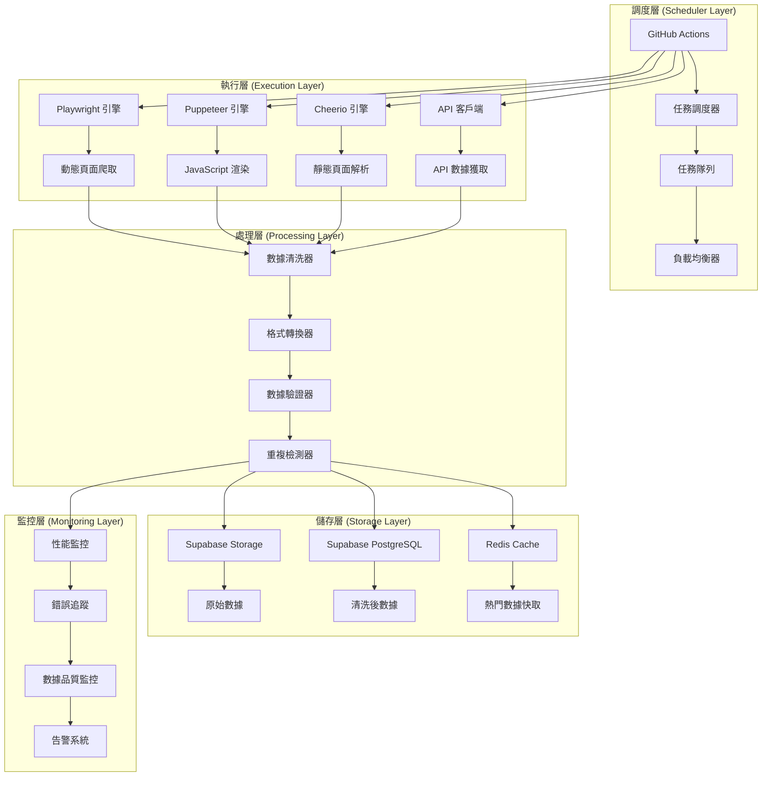

# 爬取策略實施方案

## 策略概述

本文件詳細描述全球軟體資訊平台的爬取策略實施方案，包括技術選型、架構設計、實施步驟和最佳實踐。

## 核心策略原則

### 1. API 優先策略
- **優先級順序**：官方 API > RSS/站點地圖 > 靜態頁解析 > 動態渲染截取
- **實施原則**：對於提供 API 的來源，優先使用官方 API
- **優勢分析**：穩定、高效、不易因網站改版失效

### 2. 合規性策略
- **robots.txt 遵守**：嚴格遵守各網站的 robots.txt 規則
- **使用條款遵守**：遵守各平台的使用條款和服務協議
- **版權保護**：不複製受版權保護的內容，僅獲取公開資訊

### 3. 性能優化策略
- **並發控制**：避免對目標網站造成過大壓力
- **快取策略**：實施多層快取機制提升效率
- **資源管理**：合理分配和利用系統資源

## 技術架構設計

### 爬蟲系統架構



### 爬蟲引擎選擇矩陣

| 網站類型 | 推薦引擎 | 適用場景 | 優點 | 缺點 |
|---------|---------|---------|------|------|
| 靜態網站 | Cheerio + Axios | 新聞網站、文檔網站 | 速度快、資源消耗少 | 無法處理 JavaScript |
| 動態網站 | Playwright | 單頁應用、複雜互動 | 功能完整、穩定性高 | 資源消耗較大 |
| JavaScript 渲染 | Puppeteer | 需要渲染的頁面 | 輕量級、Chrome 核心 | 功能相對簡單 |
| API 服務 | 自定義客戶端 | 提供 API 的平台 | 效率最高、最穩定 | 依賴 API 可用性 |

## 實施步驟

### 第一階段：基礎架構搭建

#### 1. 開發環境準備
```bash
# 安裝必要依賴
npm install playwright puppeteer cheerio axios
npm install @types/node typescript ts-node
npm install zod joi winston

# 配置 TypeScript
npx tsc --init
```

#### 2. 基礎爬蟲框架
```typescript
// 基礎爬蟲類
abstract class BaseCrawler {
  protected abstract async crawl(): Promise<any>;
  protected abstract async process(data: any): Promise<any>;
  protected abstract async validate(data: any): Promise<boolean>;
  
  public async execute(): Promise<void> {
    try {
      const rawData = await this.crawl();
      const processedData = await this.process(rawData);
      const isValid = await this.validate(processedData);
      
      if (isValid) {
        await this.save(processedData);
      }
    } catch (error) {
      await this.handleError(error);
    }
  }
}
```

#### 3. 配置管理系統
```typescript
// 爬蟲配置介面
interface CrawlerConfig {
  name: string;
  url: string;
  engine: 'playwright' | 'puppeteer' | 'cheerio' | 'api';
  schedule: string; // cron 表達式
  retryCount: number;
  timeout: number;
  headers?: Record<string, string>;
}
```

### 第二階段：爬蟲引擎實現

#### 1. Playwright 引擎
```typescript
class PlaywrightCrawler extends BaseCrawler {
  private browser: Browser;
  
  async init(): Promise<void> {
    this.browser = await chromium.launch({
      headless: true,
      args: ['--no-sandbox', '--disable-setuid-sandbox']
    });
  }
  
  async crawl(): Promise<any> {
    const page = await this.browser.newPage();
    
    // 設置 User-Agent
    await page.setUserAgent('Mozilla/5.0 (compatible; SoftHubBot/1.0)');
    
    // 導航到目標頁面
    await page.goto(this.config.url, { waitUntil: 'networkidle' });
    
    // 等待特定元素加載
    await page.waitForSelector(this.config.selector);
    
    // 提取數據
    const data = await page.evaluate(() => {
      // 頁面內 JavaScript 代碼
      return {
        title: document.title,
        content: document.querySelector('.content')?.textContent,
        timestamp: new Date().toISOString()
      };
    });
    
    await page.close();
    return data;
  }
}
```

#### 2. Cheerio 引擎
```typescript
class CheerioCrawler extends BaseCrawler {
  async crawl(): Promise<any> {
    const response = await axios.get(this.config.url, {
      headers: this.config.headers,
      timeout: this.config.timeout
    });
    
    const $ = cheerio.load(response.data);
    
    return {
      title: $('title').text(),
      content: $('.content').text(),
      links: $('a').map((_, el) => $(el).attr('href')).get()
    };
  }
}
```

#### 3. API 客戶端
```typescript
class APICrawler extends BaseCrawler {
  async crawl(): Promise<any> {
    const response = await axios.get(this.config.url, {
      headers: {
        'Authorization': `Bearer ${this.config.apiKey}`,
        'Accept': 'application/json'
      },
      params: this.config.params
    });
    
    return response.data;
  }
}
```

### 第三階段：數據處理與驗證

#### 1. 數據清洗器
```typescript
class DataCleaner {
  static cleanHTML(html: string): string {
    return html
      .replace(/<script[^>]*>[\s\S]*?<\/script>/gi, '')
      .replace(/<style[^>]*>[\s\S]*?<\/style>/gi, '')
      .replace(/<[^>]+>/g, '')
      .replace(/\s+/g, ' ')
      .trim();
  }
  
  static normalizeText(text: string): string {
    return text
      .replace(/\n+/g, '\n')
      .replace(/\t+/g, ' ')
      .replace(/\s+/g, ' ')
      .trim();
  }
  
  static extractLinks(html: string): string[] {
    const linkRegex = /href=["']([^"']+)["']/gi;
    const links: string[] = [];
    let match;
    
    while ((match = linkRegex.exec(html)) !== null) {
      links.push(match[1]);
    }
    
    return [...new Set(links)]; // 去重
  }
}
```

#### 2. 數據驗證器
```typescript
class DataValidator {
  static validateArticle(data: any): boolean {
    const schema = z.object({
      title: z.string().min(1).max(500),
      content: z.string().min(10),
      url: z.string().url(),
      publishedAt: z.string().datetime().optional(),
      author: z.string().optional(),
      category: z.string().optional()
    });
    
    try {
      schema.parse(data);
      return true;
    } catch (error) {
      console.error('數據驗證失敗:', error);
      return false;
    }
  }
  
  static validateRepository(data: any): boolean {
    const schema = z.object({
      name: z.string().min(1),
      description: z.string().optional(),
      stars: z.number().min(0),
      forks: z.number().min(0),
      language: z.string().optional(),
      url: z.string().url()
    });
    
    try {
      schema.parse(data);
      return true;
    } catch (error) {
      console.error('數據驗證失敗:', error);
      return false;
    }
  }
}
```

#### 3. 重複檢測器
```typescript
class DuplicateDetector {
  private cache = new Map<string, string>();
  
  isDuplicate(content: string, threshold: number = 0.8): boolean {
    const hash = this.generateHash(content);
    
    for (const [existingHash, existingContent] of this.cache) {
      const similarity = this.calculateSimilarity(content, existingContent);
      if (similarity > threshold) {
        return true;
      }
    }
    
    this.cache.set(hash, content);
    return false;
  }
  
  private generateHash(content: string): string {
    return crypto.createHash('md5').update(content).digest('hex');
  }
  
  private calculateSimilarity(text1: string, text2: string): number {
    // 使用 Jaccard 相似度算法
    const words1 = new Set(text1.toLowerCase().split(/\s+/));
    const words2 = new Set(text2.toLowerCase().split(/\s+/));
    
    const intersection = new Set([...words1].filter(x => words2.has(x)));
    const union = new Set([...words1, ...words2]);
    
    return intersection.size / union.size;
  }
}
```

### 第四階段：錯誤處理與重試

#### 1. 錯誤分類器
```typescript
enum ErrorType {
  NETWORK_ERROR = 'NETWORK_ERROR',
  HTTP_ERROR = 'HTTP_ERROR',
  PARSE_ERROR = 'PARSE_ERROR',
  VALIDATION_ERROR = 'VALIDATION_ERROR',
  RATE_LIMIT_ERROR = 'RATE_LIMIT_ERROR'
}

class ErrorClassifier {
  static classify(error: any): ErrorType {
    if (error.code === 'ECONNRESET' || error.code === 'ETIMEDOUT') {
      return ErrorType.NETWORK_ERROR;
    }
    
    if (error.response?.status >= 400 && error.response?.status < 500) {
      return ErrorType.HTTP_ERROR;
    }
    
    if (error.response?.status === 429) {
      return ErrorType.RATE_LIMIT_ERROR;
    }
    
    if (error.name === 'ValidationError') {
      return ErrorType.VALIDATION_ERROR;
    }
    
    return ErrorType.PARSE_ERROR;
  }
}
```

#### 2. 重試管理器
```typescript
class RetryManager {
  async executeWithRetry<T>(
    operation: () => Promise<T>,
    maxRetries: number = 3,
    baseDelay: number = 1000
  ): Promise<T> {
    let lastError: Error;
    
    for (let attempt = 1; attempt <= maxRetries; attempt++) {
      try {
        return await operation();
      } catch (error) {
        lastError = error;
        
        if (attempt === maxRetries) {
          throw lastError;
        }
        
        const delay = baseDelay * Math.pow(2, attempt - 1); // 指數退避
        await this.sleep(delay);
      }
    }
    
    throw lastError!;
  }
  
  private sleep(ms: number): Promise<void> {
    return new Promise(resolve => setTimeout(resolve, ms));
  }
}
```

### 第五階段：監控與日誌

#### 1. 日誌系統
```typescript
class Logger {
  private logger: winston.Logger;
  
  constructor() {
    this.logger = winston.createLogger({
      level: 'info',
      format: winston.format.combine(
        winston.format.timestamp(),
        winston.format.json()
      ),
      transports: [
        new winston.transports.File({ filename: 'crawler.log' }),
        new winston.transports.Console()
      ]
    });
  }
  
  info(message: string, meta?: any): void {
    this.logger.info(message, meta);
  }
  
  error(message: string, meta?: any): void {
    this.logger.error(message, meta);
  }
  
  warn(message: string, meta?: any): void {
    this.logger.warn(message, meta);
  }
}
```

#### 2. 性能監控
```typescript
class PerformanceMonitor {
  private metrics = new Map<string, number[]>();
  
  startTimer(operation: string): () => void {
    const startTime = Date.now();
    
    return () => {
      const duration = Date.now() - startTime;
      if (!this.metrics.has(operation)) {
        this.metrics.set(operation, []);
      }
      this.metrics.get(operation)!.push(duration);
    };
  }
  
  getAverageTime(operation: string): number {
    const times = this.metrics.get(operation);
    if (!times || times.length === 0) return 0;
    
    return times.reduce((sum, time) => sum + time, 0) / times.length;
  }
  
  getMetrics(): Record<string, number> {
    const result: Record<string, number> = {};
    
    for (const [operation, times] of this.metrics) {
      result[operation] = this.getAverageTime(operation);
    }
    
    return result;
  }
}
```

## 部署與配置

### GitHub Actions 配置
```yaml
name: Crawler Pipeline

on:
  schedule:
    - cron: '0 */6 * * *'  # 每6小時執行一次
  workflow_dispatch:  # 手動觸發

jobs:
  crawl:
    runs-on: ubuntu-latest
    
    steps:
    - uses: actions/checkout@v3
    
    - name: Setup Node.js
      uses: actions/setup-node@v3
      with:
        node-version: '18'
        cache: 'npm'
    
    - name: Install dependencies
      run: npm ci
    
    - name: Run crawlers
      run: npm run crawl:all
      env:
        SUPABASE_URL: ${{ secrets.SUPABASE_URL }}
        SUPABASE_KEY: ${{ secrets.SUPABASE_KEY }}
    
    - name: Upload logs
      uses: actions/upload-artifact@v3
      with:
        name: crawler-logs
        path: logs/
```

### Docker 配置
```dockerfile
FROM node:18-alpine

WORKDIR /app

COPY package*.json ./
RUN npm ci --only=production

COPY . .

RUN npm run build

EXPOSE 3000

CMD ["npm", "start"]
```

## 最佳實踐

### 1. 爬取頻率控制
- **新聞類內容**：1-3 小時更新一次
- **技術文檔**：24-48 小時更新一次
- **排名數據**：6-24 小時更新一次
- **開源專案**：6-12 小時更新一次

### 2. 錯誤處理策略
- **網路錯誤**：立即重試，最多 3 次
- **HTTP 錯誤**：根據錯誤類型決定重試策略
- **解析錯誤**：記錄錯誤並跳過，不重試
- **驗證錯誤**：記錄錯誤並跳過，不重試

### 3. 數據品質保證
- **結構驗證**：使用 Zod 進行強類型驗證
- **內容驗證**：檢查必要欄位是否存在
- **格式驗證**：驗證 URL、日期等格式
- **重複檢測**：使用內容哈希和相似度算法

### 4. 性能優化
- **並發控制**：限制同時運行的爬蟲數量
- **快取策略**：實施多層快取機制
- **資源管理**：及時釋放不需要的資源
- **監控告警**：設置性能指標告警

## 總結

本爬取策略實施方案提供了完整的技術架構和實施步驟，包括：

1. **清晰的策略原則**：API 優先、合規性、性能優化
2. **完整的技術架構**：調度層、執行層、處理層、儲存層、監控層
3. **詳細的實施步驟**：從基礎架構到監控系統的完整流程
4. **實用的代碼示例**：各種爬蟲引擎的具體實現
5. **完善的部署配置**：GitHub Actions 和 Docker 配置
6. **有效的最佳實踐**：頻率控制、錯誤處理、品質保證、性能優化

通過這個方案，我們可以建立一個穩定、高效、合規的爬蟲系統，為全球軟體資訊平台提供高品質的數據內容。
