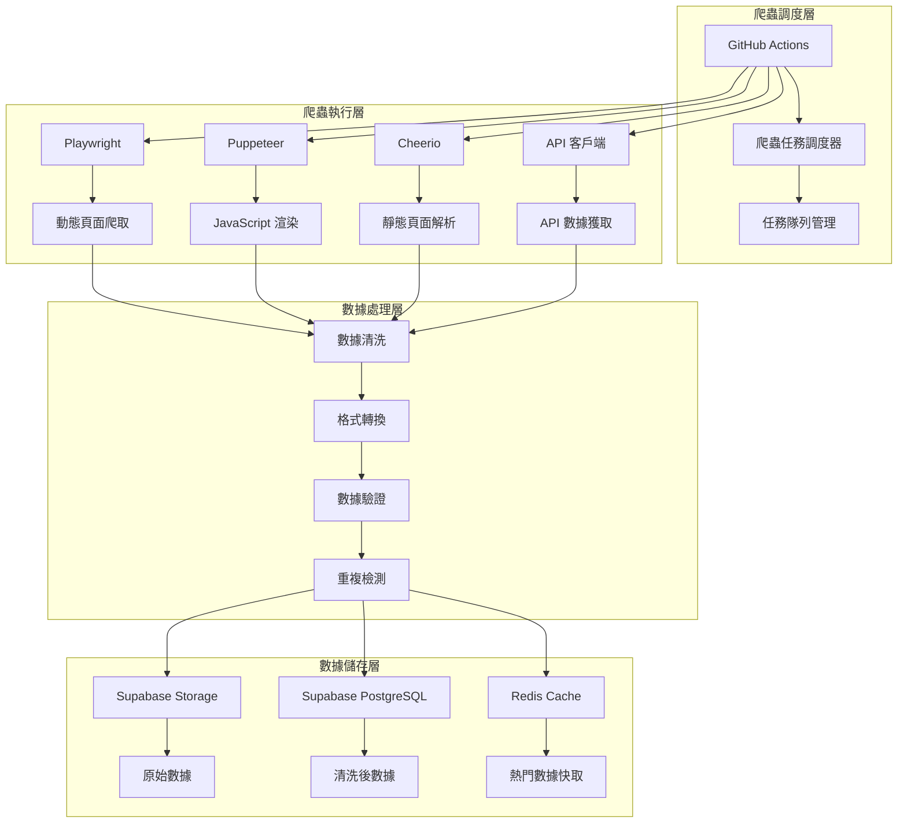
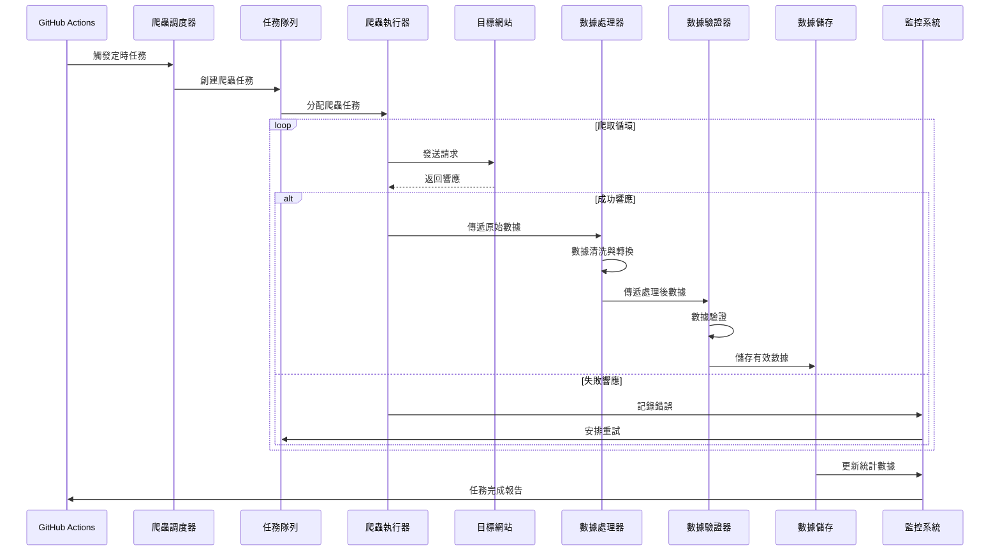
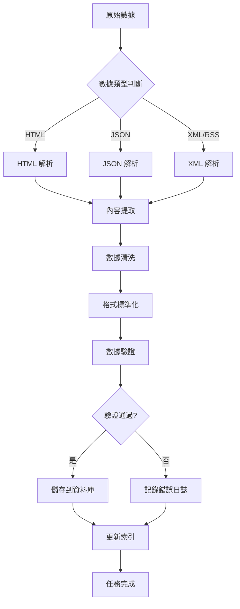

# 資料來源與爬取策略

## 爬取原則與法遵

### 基本原則
- **API 優先**：優先使用官方 API > RSS/站點地圖 > 靜態頁解析 > 動態渲染截取
- **合規性**：嚴守 robots.txt 與網站 TOS，附加識別 UA、節流、指數退避重試
- **法遵要求**：不繞過付費牆、不抓取受限內容、不複製大段全文、提供來源鏈接、清楚標示商標/版權

## 資料來源與爬取方法

### 1. 開源專案 (Repositories)

#### GitHub API
- **方法**：官方 REST/GraphQL API
- **主要欄位**：stars, forks, topics, language, readme, releases, contributors, issues
- **爬取頻率**：6 小時
- **技術細節**：
  - 使用 ETag/If-None-Match 減少流量
  - 尊重 rate limit (5000 requests/hour for authenticated users)
  - 支援 GraphQL 批量查詢提升效率
- **備註**：最穩定的資料來源，API 文檔完整

#### GitLab API
- **方法**：官方 API
- **主要欄位**：同上
- **爬取頻率**：12 小時
- **技術細節**：
  - 公開專案為主
  - 支援分頁查詢
  - 需要 API token 認證

#### Hugging Face API
- **方法**：官方 API
- **主要欄位**：likes, downloads, tags, model card, task type, framework
- **爬取頻率**：6 小時
- **技術細節**：
  - 任務型/框架型標籤分類
  - 支援模型下載統計
  - 社群互動數據

#### SourceForge
- **方法**：RSS/API/專案頁
- **主要欄位**：名稱、描述、下載量、評分、分類
- **爬取頻率**：24 小時
- **技術細節**：優先使用 RSS feed

### 2. IT 新聞與媒體

#### 國際媒體
- **來源**：Tom's Hardware, Wired, CNET, TechCrunch
- **方法**：RSS/站點地圖/靜態頁
- **主要欄位**：標題、摘要、作者、時間、分類、連結、圖片
- **爬取頻率**：1-3 小時
- **技術細節**：
  - 僅抓取公開摘要與連結
  - 不鏡像全文內容
  - 支援多語言內容

#### 台灣媒體
- **來源**：TechOrange, INSIDE, 電腦王阿達, T客邦
- **方法**：RSS/站點地圖/動態頁面
- **主要欄位**：標題、摘要、作者、時間、分類、連結
- **爬取頻率**：2-4 小時
- **技術細節**：部分網站使用 JavaScript 渲染

#### 中國媒體
- **來源**：36氪, 掘金, 極客公園
- **方法**：RSS/API/動態頁面
- **主要欄位**：標題、摘要、作者、時間、分類、連結
- **爬取頻率**：2-4 小時

### 3. 學習資源

#### 線上課程平台
- **來源**：Udemy, Coursera, edX, Pluralsight
- **方法**：公開 Catalog API/合作 Feed
- **主要欄位**：課程名、講師、評分、連結、價格區間、時長、難度
- **爬取頻率**：24 小時
- **技術細節**：使用聯盟參數（如允許）

#### 技術文檔
- **來源**：各開源專案官方文檔、MDN Web Docs, W3Schools
- **方法**：API/靜態頁面
- **主要欄位**：標題、內容、版本、更新時間、連結
- **爬取頻率**：24-48 小時

### 4. 排名數據

#### 硬體排名
- **來源**：PassMark, UserBenchmark, 3DMark
- **方法**：公開頁/表格
- **主要欄位**：CPU/GPU 分數、型號、價格、性能指標
- **爬取頻率**：24-72 小時
- **技術細節**：僅引用官方可用摘要與連結

#### 資料庫排名
- **來源**：DB-Engines, Stack Overflow Developer Survey
- **方法**：公開頁面
- **主要欄位**：Rank, Trend, 使用率統計
- **爬取頻率**：24 小時

#### LLM 排行榜
- **來源**：Hugging Face Open LLM Leaderboard, Papers With Code
- **方法**：官方 API/頁面
- **主要欄位**：模型、分數、日期、任務類型
- **爬取頻率**：6 小時

### 5. 影片內容

#### YouTube
- **方法**：Data API v3
- **主要欄位**：影片 ID、標題、頻道、縮圖、觀看次數、評分
- **爬取頻率**：6 小時
- **技術細節**：僅存連結與中繼資料

## 爬取技術實現

### 爬蟲架構設計

### 爬蟲引擎選擇策略

#### 1. API 優先原則
- **適用場景**：GitHub, Hugging Face, GitLab, Udemy, Coursera 等
- **優勢**：穩定、高效、不易因網站改版失效
- **注意事項**：各平台 API Rate Limit 處理

#### 2. 動態網頁爬取
- **適用場景**：大量使用 JavaScript 動態渲染的網站
- **技術選擇**：Playwright 或 Puppeteer
- **優勢**：能模擬真實用戶行為，獲取最終渲染的 HTML

#### 3. 靜態網頁爬取
- **適用場景**：內容相對靜態的網站
- **技術選擇**：Cheerio (搭配 axios 或 node-fetch)
- **優勢**：比啟動完整瀏覽器核心更快、資源消耗更少

#### 4. 混合策略
- **架構設計**：建立可配置的爬蟲服務
- **引擎選擇**：針對不同目標網站選擇不同爬取引擎
- **配置管理**：透過配置文件控制爬取策略

### 錯誤處理與重試機制

#### 錯誤分類
1. **網路錯誤**：連接超時、DNS 解析失敗
2. **HTTP 錯誤**：4xx 客戶端錯誤、5xx 伺服器錯誤
3. **解析錯誤**：HTML 結構變化、API 格式變更
4. **限制錯誤**：Rate limiting、IP 封鎖

#### 重試策略
- **指數退避**：重試間隔逐漸增加
- **最大重試次數**：避免無限重試
- **錯誤日誌記錄**：詳細記錄失敗原因
- **告警機制**：連續失敗時發送通知

### 數據品質保證

#### 數據驗證
- **結構驗證**：使用 Zod 或 Joi 驗證數據結構
- **類型檢查**：確保數據類型正確
- **範圍驗證**：數值在合理範圍內
- **格式驗證**：日期、URL 等格式正確

#### 重複檢測
- **內容哈希**：計算內容的 MD5 或 SHA256 哈希
- **相似度檢測**：使用文本相似度算法
- **時間窗口**：在時間窗口內檢測重複

#### 數據清洗
- **HTML 標籤清理**：移除不必要的 HTML 標籤
- **空白字符處理**：清理多餘的空白字符
- **特殊字符轉換**：處理特殊字符和編碼問題
- **數據標準化**：統一數據格式和單位

## 爬蟲運作流程

### 完整爬蟲流程圖

### 數據處理流程

## 性能優化策略

### 並發控制
- **並發數限制**：避免對目標網站造成過大壓力
- **請求間隔**：在請求之間添加適當延遲
- **IP 輪換**：使用代理池輪換 IP 地址
- **User-Agent 輪換**：隨機選擇不同的 User-Agent

### 快取策略
- **HTTP 快取**：利用 ETag 和 Last-Modified 標頭
- **本地快取**：快取已爬取的頁面內容
- **數據庫快取**：快取熱門查詢結果
- **CDN 快取**：使用 CDN 快取靜態資源

### 資源管理
- **記憶體管理**：及時釋放不需要的資源
- **連接池**：重用 HTTP 連接
- **超時設置**：設置合理的請求超時時間
- **錯誤隔離**：單個爬蟲失敗不影響其他爬蟲

## 監控與維護

### 監控指標
- **爬取成功率**：成功爬取的頁面比例
- **數據品質指標**：數據完整性和準確性
- **性能指標**：爬取速度和資源使用情況
- **錯誤統計**：各種錯誤類型的發生頻率

### 告警機制
- **失敗率告警**：當失敗率超過閾值時發送告警
- **數據品質告警**：當數據品質下降時發送告警
- **性能告警**：當爬取速度過慢時發送告警
- **系統健康告警**：當系統出現異常時發送告警

### 維護策略
- **定期檢查**：定期檢查爬蟲的運行狀態
- **數據備份**：定期備份重要的爬取數據
- **版本更新**：及時更新爬蟲程式和依賴庫
- **文檔維護**：保持爬蟲文檔的更新

## 法律與道德考量

### 合規性要求
- **robots.txt 遵守**：嚴格遵守網站的 robots.txt 規則
- **使用條款**：遵守各網站的使用條款
- **版權尊重**：不複製受版權保護的內容
- **隱私保護**：不收集個人隱私信息

### 道德準則
- **負責任爬取**：不對目標網站造成過大負擔
- **透明度**：明確標示爬取內容的來源
- **公平使用**：合理使用爬取的數據
- **社會責任**：確保爬取行為對社會有益

## 總結

本文件詳細描述了全球軟體資訊平台的資料來源與爬取策略，包括：

1. **完整的資料來源清單**：涵蓋開源專案、新聞媒體、學習資源、排名數據等
2. **技術實現方案**：提供多種爬蟲引擎的選擇策略和實現細節
3. **流程圖與架構**：使用 Mermaid 語法繪製清晰的流程圖
4. **品質保證機制**：數據驗證、清洗、重複檢測等
5. **性能優化策略**：並發控制、快取策略、資源管理等
6. **監控維護方案**：監控指標、告警機制、維護策略等
7. **法律道德考量**：合規性要求、道德準則等

通過這些策略的實施，我們可以建立一個穩定、高效、合規的數據爬取系統，為平台提供高品質的技術資訊內容。
